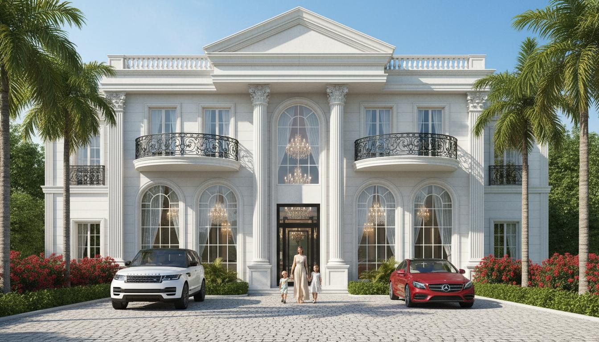

# Ekras Yapı A.Ş. Website Clone

A pixel-perfect clone of the [Ekras Yapı A.Ş.](https://www.ekrasyapi.com) construction company website. This project is a fully responsive, single-page website built with pure HTML, CSS, and JavaScript.



## Features

- **Full-screen Hero Slider** - Auto-playing image carousel with 5 architectural rendering slides, navigation arrows, and dot indicators
- **Sticky Navigation Header** - Transparent-to-solid transition on scroll, with dropdown menu for projects
- **Responsive Design** - Fully responsive for desktop, tablet, and mobile devices
- **Smooth Scrolling** - Anchor link navigation with header offset
- **Contact Form** - Client-side validation with toast notifications
- **Interactive Map** - Leaflet.js integration with OpenStreetMap tiles
- **Image Gallery** - Multimedia section with lightbox functionality
- **Back to Top Button** - Appears after scrolling 300px
- **Scroll Reveal Animations** - Cards and sections animate into view on scroll
- **Touch/Swipe Support** - Mobile swipe gestures for hero slider

## Tech Stack

- **HTML5** - Semantic markup
- **CSS3** - Custom styles with responsive breakpoints
- **JavaScript (ES6+)** - Vanilla JS, no frameworks
- **Google Fonts** - Open Sans font family
- **Font Awesome 6.4.0** - Icons via CDN
- **Leaflet.js** - Interactive map

## Project Structure

```
.
├── index.html              # Main HTML file
├── css/
│   └── style.css           # All styles
├── js/
│   └── script.js           # All JavaScript functionality
├── images/
│   ├── hero-1.jpg          # Hero slider images (5)
│   ├── hero-2.jpg
│   ├── hero-3.jpg
│   ├── hero-4.jpg
│   ├── hero-5.jpg
│   ├── about.jpg           # About section image
│   ├── proj-1.jpg          # Project card images (6)
│   ├── proj-2.jpg
│   ├── proj-3.jpg
│   ├── proj-4.jpg
│   ├── proj-5.jpg
│   ├── proj-6.jpg
│   ├── svc-1.jpg           # Service card images (4)
│   ├── svc-2.jpg
│   ├── svc-3.jpg
│   └── svc-4.jpg
└── README.md
```

## Sections

1. **Header/Navigation** - Fixed navbar with logo, nav links, dropdown menu, and mobile hamburger
2. **Hero Slider** - Full-viewport image carousel with 5 architectural slides
3. **Kurumsal (About)** - Company description with image
4. **Projelerimiz (Projects)** - 6-project grid showcasing portfolio
5. **Hizmetlerimiz (Services)** - 4-service grid (Building Lighting, Glass Balcony, Roof Systems, Pool Construction)
6. **Multimedya (Gallery)** - Image gallery with lightbox
7. **Iletisim (Contact)** - Contact form, map, and contact info
8. **Footer** - 4-column footer with about, pages, projects, and contact info
9. **Copyright Bar** - Dark navy bar with copyright text

## Design Tokens

| Token | Value | Usage |
|-------|-------|-------|
| Navy | #0a0e2a | Copyright bar, dark overlays |
| Gold | #c9a84c | Logo accent, brand highlights |
| Lime | #c8d400 | CTA buttons, back-to-top button |
| White | #ffffff | Main backgrounds |
| Light Gray | #f0f0f0 | Footer, section alternation |
| Body Text | #333333 | Primary text color |
| Heading | #1a1a1a | Headings, titles |

## Responsive Breakpoints

| Breakpoint | Width | Layout Changes |
|------------|-------|----------------|
| Desktop | > 1024px | Full layout |
| Tablet | 768px - 1024px | 2-column grids, hamburger menu |
| Mobile | < 768px | Single column, stacked layouts |
| Small Mobile | < 480px | Full-width elements |

## Browser Support

- Chrome 90+
- Firefox 88+
- Safari 14+
- Edge 90+

## Credits

- Original website: [ekrasyapi.com](https://www.ekrasyapi.com)
- Images: AI-generated architectural renderings
- Map data: OpenStreetMap contributors

## License

This is a clone project for educational purposes. All rights to the original design and brand belong to Ekras Yapı A.Ş.

---

**Note:** This is a frontend demo. The contact form does not send actual emails - it shows a success message for demonstration purposes.
